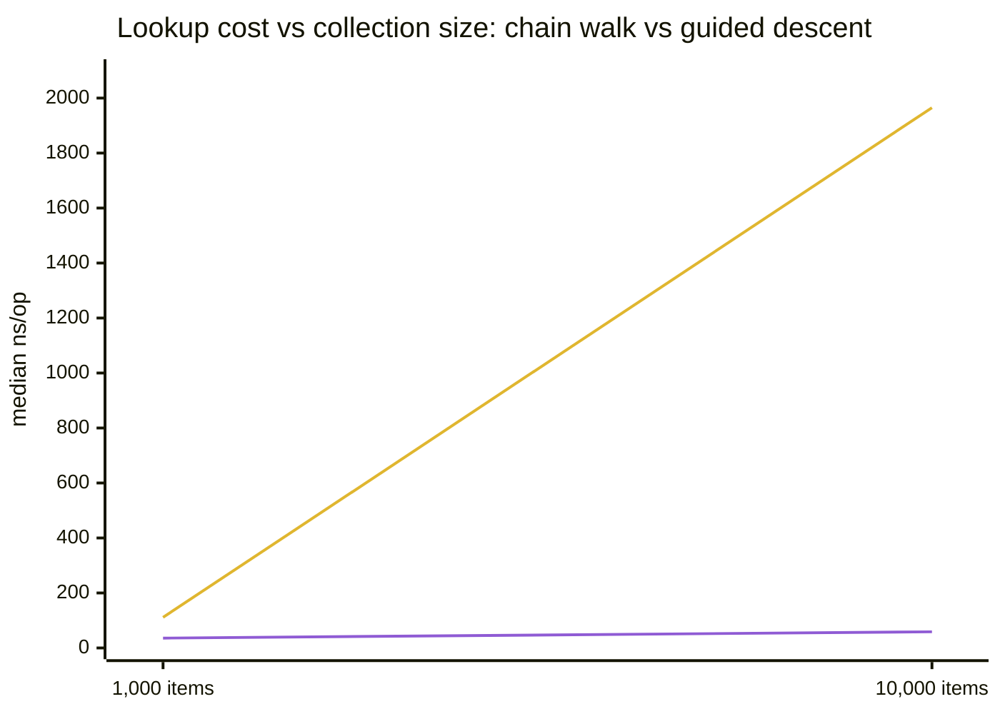
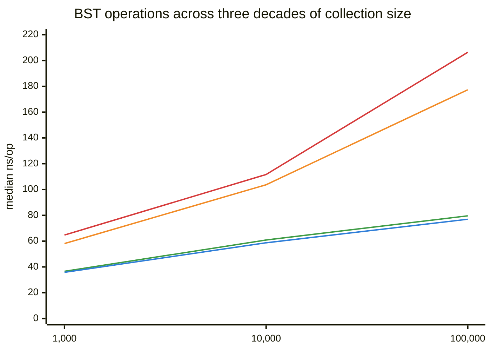

# Benchmarks

Timing evidence for the completed modules, collected with the dependency-free
harness in this folder. Every number below was measured on the development
machine (Windows, Clang, `-O2`) with 21 independent samples per operation.
These are regression evidence for this environment — not portable speed claims
and not proof of Big-O complexity. Complexity is an asymptotic statement;
benchmarks at fixed sizes can only be *consistent* with it.

## How the Harness Works

`benchmark.h` / `benchmark.c` time repeated operations inside one process:

1. **Warmup** runs the operation untimed to populate instruction and data caches.
2. **Setup** builds fresh state (a new container, populated if needed) *outside*
   the timed region, once per sample.
3. **The timed region** contains only the operation loop — no allocation of the
   container, no verification, no teardown.
4. **Verify** checks after the clock stops that the batch really did its work,
   so the compiler cannot silently skip operations and the harness cannot
   report a fast lie.
5. Each sample reports nanoseconds per operation; the result is the median,
   minimum, and maximum across all 21 samples. The median resists interference
   from OS scheduling spikes; a wide min-max spread is a signal to distrust
   the number.

Timing uses `QueryPerformanceCounter` on Windows and
`clock_gettime(CLOCK_MONOTONIC)` on POSIX.

## Results at 10,000 Items

Default sample shape: 21 samples x 10,000 operations (linked list: 2,000,
because its traversal costs would otherwise dominate the suite's runtime).

| Structure / operation | Median ns/op | Expected complexity |
| --- | ---: | --- |
| Queue dequeue | 3.30 | O(1) |
| Dynamic array append | 5.87 | O(1) amortized |
| Stack pop | 7.22 | O(1) |
| Stack push | 9.60 | O(1) amortized |
| Queue enqueue | 11.20 | O(1) amortized |
| Linked list pop front | 15.45 | O(1) |
| BST find | 58.72 | O(log n) average |
| BST contains | 60.88 | O(log n) average |
| Linked list push front | 64.30 | O(1) + malloc |
| BST remove | 103.70 | O(log n) average |
| BST insert | 111.65 | O(log n) average + malloc |
| Linked list remove middle | 511.25 | O(n) traversal |
| Linked list get middle | 976.40 | O(n) traversal |
| Linked list pop back | 1,365.20 | O(n) traversal |
| Linked list push back | 1,415.60 | O(n) traversal |
| Hash table remove | 1,793.73 | O(1) expected — **O(n/buckets) with 10 fixed buckets** |
| Hash table set | 1,821.51 | O(1) expected — **O(n/buckets) with 10 fixed buckets** |
| Hash table get | 1,965.16 | O(1) expected — **O(n/buckets) with 10 fixed buckets** |
| Hash table contains | 1,973.57 | O(1) expected — **O(n/buckets) with 10 fixed buckets** |
| Linked list insert middle | 2,773.05 | O(n) traversal |

The spread spans three orders of magnitude, so it is split into two charts —
a single linear axis would flatten the fast group into invisible slivers.
Bars are color-coded by structure; Mermaid's chart renderer has no hover
tooltips or built-in legend, so each chart carries its legend inline below it.

**The fast group — O(1) and O(log n) operations (median ns/op at 10,000 items):**

```mermaid
---
config:
  xyChart:
    chartOrientation: horizontal
    width: 800
    height: 520
  themeVariables:
    xyChart:
      plotColorPalette: "#2f7ed8, #f28c28, #d63b3b, #3f9c46, #8f5bd4"
---
xychart-beta
    title "Constant-time and logarithmic operations"
    x-axis ["queue dequeue", "array append", "stack pop", "stack push", "queue enqueue", "list pop front", "BST find", "BST contains", "list push front", "BST remove", "BST insert"]
    y-axis "median ns/op" 0 --> 120
    bar [3.30, 0, 0, 0, 11.20, 0, 0, 0, 0, 0, 0]
    bar [0, 5.87, 0, 0, 0, 0, 0, 0, 0, 0, 0]
    bar [0, 0, 7.22, 9.60, 0, 0, 0, 0, 0, 0, 0]
    bar [0, 0, 0, 0, 0, 15.45, 0, 0, 64.30, 0, 0]
    bar [0, 0, 0, 0, 0, 0, 58.72, 60.88, 0, 103.70, 111.65]
```



🟦 queue · 🟧 dynamic array · 🟥 stack · 🟩 singly linked list · 🟪 binary search tree

**The slow group — traversal-bound operations (median ns/op at 10,000 items;
linked list measured at 2,000 items):**

```mermaid
---
config:
  xyChart:
    chartOrientation: horizontal
    width: 800
    height: 460
  themeVariables:
    xyChart:
      plotColorPalette: "#3f9c46, #e0b62f"
---
xychart-beta
    title "Linear-traversal operations"
    x-axis ["list remove middle", "list get middle", "list pop back", "list push back", "hash remove", "hash set", "hash get", "hash contains", "list insert middle"]
    y-axis "median ns/op" 0 --> 2900
    bar [511.25, 976.40, 1365.20, 1415.60, 0, 0, 0, 0, 2773.05]
    bar [0, 0, 0, 0, 1793.73, 1821.51, 1965.16, 1973.57, 0]
```



🟩 singly linked list · 🟨 hash table (10 fixed buckets)

Read the two value axes carefully: the *longest* bar of the fast group (BST
insert, 111.65) would be a barely visible sliver at the base of the slow
group's chart. That gap — not any single number — is the point.

## Why It Plays Out This Way

### The contiguous structures (stack, queue, dynamic array) are the floor

3-11 ns/op is a handful of instructions: bounds check, pointer write, counter
update. Three effects make them this fast:

- **No per-operation allocation.** Growth is amortized — the occasional
  `realloc` doubles capacity, so 10,000 pushes trigger ~14 resizes, not 10,000
  allocations.
- **Cache locality.** Adjacent operations touch adjacent memory. The prefetcher
  sees a linear scan and stays ahead of it.
- **No pointer chasing.** The address of slot `i` is computable arithmetic, not
  a dependent load waiting on the previous load.

Dequeue (3.30) beats push (9.60) because the pop/dequeue path does no capacity
check at all; enqueue and push pay the branch plus occasional resize. These
differences are real but tiny — everything in this group is effectively "as
fast as memory allows."

### The linked list is a lesson in what pointers cost

```mermaid
---
config:
  xyChart:
    chartOrientation: horizontal
    width: 800
    height: 400
  themeVariables:
    xyChart:
      plotColorPalette: "#2f7ed8, #8f5bd4, #d63b3b"
---
xychart-beta
    title "One structure, three cost tiers (singly linked list, 2,000 items)"
    x-axis ["pop front", "push front", "remove middle", "get middle", "pop back", "push back", "insert middle"]
    y-axis "median ns/op" 0 --> 2900
    bar [15.45, 0, 0, 0, 0, 0, 0]
    bar [0, 64.30, 0, 0, 0, 0, 0]
    bar [0, 0, 511.25, 976.40, 1365.20, 1415.60, 2773.05]
```



🟦 pointer-only (held end) · 🟪 O(1) + malloc · 🟥 traversal-bound

The tiers are visible at a glance: pointer-only operations at the held end
(~15 ns), allocation-bearing operations (~64 ns), and anything requiring a
traversal (500-2,800 ns). Push front (64.30) is O(1) yet ~7x slower than stack
push: each insertion calls `malloc`, and each node lands wherever the
allocator put it. The moment an
operation must *traverse* — push back, get middle, insert middle — the cost
explodes to 500-2,800 ns, because every step is a dependent load with no
locality. At n=2,000, push back walks ~2,000 nodes; that measured ~1,400 ns is
under 1 ns per hop only because the benchmark's nodes were allocated together.
In a fragmented heap it would be worse.

The list deliberately keeps no tail pointer. That is a curriculum decision
(workspace rule: migrate to the right structure rather than bolt on saved
pointers), and the benchmark shows the price of the head-only contract
honestly.

### The BST sits exactly where theory says it should

Shuffled insertion keeps the unbalanced tree near log-depth. log2(10,000) ~ 13
comparisons, each one a pointer hop into likely-uncached memory plus a
comparator call through a function pointer — ~60 ns for find is about 4-5 ns
per level, which is consistent with cache-missing dependent loads.

Insert (111.65) and remove (103.70) cost roughly find plus structural work:
insert adds a `malloc`; remove adds unlink logic and a `free`. The near
symmetry of insert and remove is a good health signal for the removal
implementation.

**The shuffle matters.** Insert keys 0..9999 in ascending order and this same
tree degenerates into a 10,000-node linked list — every operation becomes the
linked list's worst row, not the BST's. The benchmark uses a fixed
Fisher-Yates permutation (deterministic LCG seed) so results are comparable
across runs while avoiding that degeneracy. This is the whole argument for
self-balancing structures: they make the shuffle unnecessary.

### The hash table is upside down — the fixed buckets explain why

O(1)-expected operations measuring 30x slower than the BST's O(log n) is the
most instructive row in the table. The table has **10 fixed buckets and no
rehashing**. At 10,000 entries, each bucket's chain is ~1,000 nodes long, and
"hashing" degrades into "walk half of a 1,000-node linked list" — which is why
its numbers land in linked-list territory.

The scaling comparison makes the shape of the failure visible:

| Items | Hash get (ns/op) | BST find (ns/op) | Ratio |
| ---: | ---: | ---: | ---: |
| 1,000 | 111.20 | 35.80 | 3.1x |
| 10,000 | 1,965.16 | 58.72 | 33x |

Hash get grew ~18x for a 10x size increase — linear-and-worse, exactly the
chain-walk prediction (the "worse" is cache effects as chains outgrow cache).
BST find grew 1.6x for the same 10x — consistent with the +log(10) ~ 3.3
levels theory adds. Neither structure changed; only n did. **This is the
clearest demonstration in the repository that complexity classes are claims
about growth, not about speed at any single size.** With load-factor resizing
and rehashing, hash get would flatten to roughly constant ~100 ns at both
sizes and beat the BST at scale.



🟨 hash table get (10 fixed buckets) · 🟪 BST find (shuffled insert)

The hash line is the visual definition of linear growth; the BST line is what
logarithmic growth looks like at benchmark scale — nearly flat.

### BST scaling, for completeness

| Items | Insert | Find | Contains | Remove |
| ---: | ---: | ---: | ---: | ---: |
| 1,000 | 64.70 | 35.80 | 36.60 | 58.10 |
| 10,000 | 111.65 | 58.72 | 60.88 | 103.70 |
| 100,000 | 206.34 | 76.96 | 79.62 | 177.33 |



🟥 insert · 🟧 remove · 🟩 contains · 🟦 find

Each 10x growth adds a roughly constant increment (find: +23, +18) rather than
multiplying the cost — the additive signature of logarithmic growth. On this
chart's linear x-axis (each step is 10x the items), perfectly logarithmic
behavior draws a straight line; find and contains are close to that. Insert
and remove bend upward at 100k because their extra work (malloc, free,
restructuring) touches more memory and misses cache more often as the tree
outgrows L2/L3.

## How the Structures Relate

The table is one story told five ways: **the price of finding your data.**

- Stack, queue, and dynamic array never search — the position is known
  arithmetic. Cost: single-digit ns.
- The linked list makes position a *walk*. O(1) at the ends it holds pointers
  to; O(n) anywhere else. Cost: 15 ns to 2,800 ns depending entirely on
  where.
- The BST turns the walk into a *guided descent* — each comparison discards
  half the remaining tree. Cost: ~4-5 ns per level, ~log n levels.
- The hash table tries to skip the search entirely by *computing* the
  location. Done right it is the fastest lookup structure here; with 10 fixed
  buckets it quietly degenerates back into the linked list it was meant to
  replace.

Every structure is generic over `void *` with caller-supplied
compare/hash functions, so all results include function-pointer call overhead.
That is the cost of the shared contract style, paid uniformly, so
cross-structure comparisons stay fair.

## Reproducing

```bash
make benchmark NAME=data-structures/linear/stacks/stack BENCHMARK=stack
make benchmark NAME=data-structures/linear/queues/queue BENCHMARK=queue
make benchmark NAME=data-structures/linear/arrays/dynamic-array BENCHMARK=dynamic_array
make benchmark NAME=data-structures/linear/linked/singly-linked-list BENCHMARK=singly_linked_list
make benchmark NAME=data-structures/associative/hash-tables/separate-chaining BENCHMARK=hash_table
make benchmark NAME=data-structures/trees/binary-search-trees/binary-search-tree BENCHMARK=binary_search_tree

# Scaling experiments: rerun any benchmark at a different size.
make benchmark NAME=... BENCHMARK=... BENCHMARK_ITEM_COUNT=1000
make benchmark NAME=... BENCHMARK=... BENCHMARK_ITEM_COUNT=100000
```

To evaluate a growth trend, run the same operation at increasing sizes and
compare normalized ns/op — constant means O(1)-like, additive increments per
10x mean logarithmic, multiplying by ~10x means linear.

## Current Coverage

| Module | Benchmark source | Operations |
| --- | --- | --- |
| Stack | `stack_benchmark.c` | push, pop |
| Queue | `queue_benchmark.c` | enqueue, dequeue |
| Dynamic array | `dynamic_array_benchmark.c` | append insertion |
| Singly linked list | `singly_linked_list_benchmark.c` | push/pop front and back, get/insert/remove middle |
| Hash table | `hash_table_benchmark.c` | set, get, contains, remove |
| Binary search tree | `binary_search_tree_benchmark.c` | insert, find, contains, remove |

Benchmarks exist for the six completed modules listed above.
