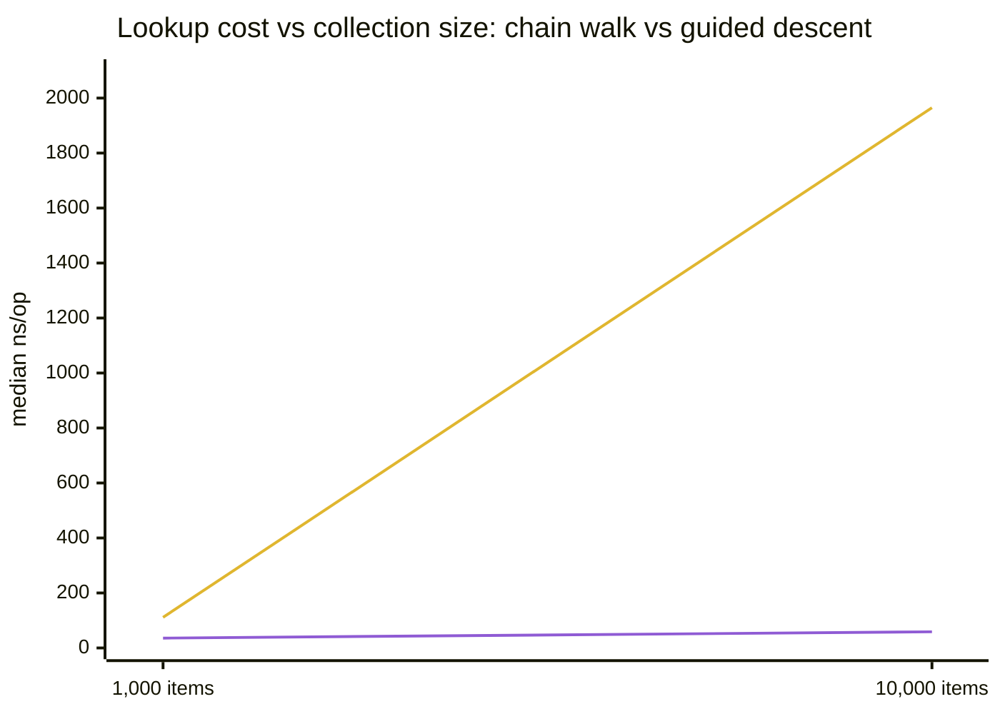
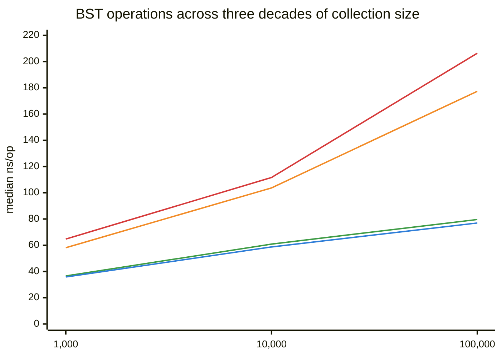

# Benchmarks

Timing evidence for the completed modules, collected with the dependency-free
harness in this folder. Every number below was measured on the development
machine (Windows, Clang, `-O2`) with 21 independent samples per operation.
These are regression evidence for this environment — not portable speed claims
and not proof of Big-O complexity. Complexity is an asymptotic statement;
benchmarks at fixed sizes can only be *consistent* with it.

## How the Harness Works

`benchmark.h` / `benchmark.c` time repeated operations inside one process:

1. **Warmup** runs the operation untimed to populate instruction and data caches.
2. **Setup** builds fresh state (a new container, populated if needed) *outside*
   the timed region, once per sample.
3. **The timed region** contains only the operation loop — no allocation of the
   container, no verification, no teardown.
4. **Verify** checks after the clock stops that the batch really did its work,
   so the compiler cannot silently skip operations and the harness cannot
   report a fast lie.
5. Each sample reports nanoseconds per operation; the result is the median,
   minimum, and maximum across all 21 samples. The median resists interference
   from OS scheduling spikes; a wide min-max spread is a signal to distrust
   the number.

Timing uses `QueryPerformanceCounter` on Windows and
`clock_gettime(CLOCK_MONOTONIC)` on POSIX.

## Results at 10,000 Items

Default sample shape: 21 samples x 10,000 operations (both linked lists and
the adjacency list: 2,000, because their traversal costs would otherwise
dominate the suite's runtime; adjacency matrix: 1,000, to keep dense matrix
allocation practical).

## Graph Results

At 1,000 distinct targets per sample, adjacency-matrix setup constructs the
graph and its dense matrix outside the timed operation loop. These figures
therefore measure direct matrix-cell operations rather than O(N^2) capacity
growth.

| Structure / operation | Median ns/op | Expected complexity |
| --- | ---: | --- |
| GraphView neighbors | 3.07 | O(1) wrapper plus adapter cost |
| GraphView node at | 3.15 | O(1) |
| GraphView vertex count | 3.28 | O(1) |
| Adjacency matrix has edge | 2.30 | O(1) |
| Adjacency matrix remove edge | 2.90 | O(1) |
| Adjacency matrix insert edge | 8.50 | O(1) |

| Structure / operation | Median ns/op | Expected complexity |
| --- | ---: | --- |
| Union-find find | 2.69 | O(alpha(n)) amortized |
| Union-find connected | 3.23 | O(alpha(n)) amortized |
| Union-find union | 3.32 | O(alpha(n)) amortized |
| Queue dequeue | 3.30 | O(1) |
| Dynamic array append | 5.87 | O(1) amortized |
| Stack pop | 7.22 | O(1) |
| Stack push | 9.60 | O(1) amortized |
| Queue enqueue | 11.20 | O(1) amortized |
| Doubly linked list pop front | 14.40 | O(1) |
| Doubly linked list pop back | 14.60 | O(1) |
| Singly linked list pop front | 15.45 | O(1) |
| Doubly linked list push back | 26.25 | O(1) + malloc |
| BST find | 58.72 | O(log n) average |
| BST contains | 60.88 | O(log n) average |
| Doubly linked list push front | 61.40 | O(1) + malloc |
| Singly linked list push front | 64.30 | O(1) + malloc |
| BST remove | 103.70 | O(log n) average |
| BST insert | 111.65 | O(log n) average + malloc |
| Singly linked list remove middle | 511.25 | O(n) traversal |
| Doubly linked list remove middle | 529.30 | O(n/2) traversal |
| Doubly linked list get middle | 973.35 | O(n/2) traversal |
| Singly linked list get middle | 976.40 | O(n) traversal |
| Singly linked list pop back | 1,365.20 | O(n) traversal |
| Singly linked list push back | 1,415.60 | O(n) traversal |
| Hash table remove | 1,793.73 | O(1) expected — **O(n/buckets) with 10 fixed buckets** |
| Hash table set | 1,821.51 | O(1) expected — **O(n/buckets) with 10 fixed buckets** |
| Hash table get | 1,965.16 | O(1) expected — **O(n/buckets) with 10 fixed buckets** |
| Hash table contains | 1,973.57 | O(1) expected — **O(n/buckets) with 10 fixed buckets** |
| Singly linked list insert middle | 2,773.05 | O(n) traversal |
| Doubly linked list insert middle | 2,787.85 | O(n/2) traversal |

The spread spans three orders of magnitude, so it is split into two charts —
a single linear axis would flatten the fast group into invisible slivers.
Bars are color-coded by structure; Mermaid's chart renderer has no hover
tooltips or built-in legend, so each chart carries its legend inline below it.

**The fast group — O(1) and O(log n) operations (median ns/op at 10,000 items):**

```mermaid
---
config:
  xyChart:
    chartOrientation: horizontal
    width: 800
    height: 520
  themeVariables:
    xyChart:
      plotColorPalette: "#2f7ed8, #f28c28, #d63b3b, #3f9c46, #8f5bd4"
---
xychart-beta
    title "Constant-time and logarithmic operations"
    x-axis ["queue dequeue", "array append", "stack pop", "stack push", "queue enqueue", "list pop front", "BST find", "BST contains", "list push front", "BST remove", "BST insert"]
    y-axis "median ns/op" 0 --> 120
    bar [3.30, 0, 0, 0, 11.20, 0, 0, 0, 0, 0, 0]
    bar [0, 5.87, 0, 0, 0, 0, 0, 0, 0, 0, 0]
    bar [0, 0, 7.22, 9.60, 0, 0, 0, 0, 0, 0, 0]
    bar [0, 0, 0, 0, 0, 15.45, 0, 0, 64.30, 0, 0]
    bar [0, 0, 0, 0, 0, 0, 58.72, 60.88, 0, 103.70, 111.65]
```



🟦 queue · 🟧 dynamic array · 🟥 stack · 🟩 singly linked list · 🟪 binary search tree

**The slow group — traversal-bound operations (median ns/op at 10,000 items;
linked list measured at 2,000 items):**

```mermaid
---
config:
  xyChart:
    chartOrientation: horizontal
    width: 800
    height: 460
  themeVariables:
    xyChart:
      plotColorPalette: "#3f9c46, #e0b62f"
---
xychart-beta
    title "Linear-traversal operations"
    x-axis ["list remove middle", "list get middle", "list pop back", "list push back", "hash remove", "hash set", "hash get", "hash contains", "list insert middle"]
    y-axis "median ns/op" 0 --> 2900
    bar [511.25, 976.40, 1365.20, 1415.60, 0, 0, 0, 0, 2773.05]
    bar [0, 0, 0, 0, 1793.73, 1821.51, 1965.16, 1973.57, 0]
```



🟩 singly linked list · 🟨 hash table (10 fixed buckets)

Read the two value axes carefully: the *longest* bar of the fast group (BST
insert, 111.65) would be a barely visible sliver at the base of the slow
group's chart. That gap — not any single number — is the point.

## Why It Plays Out This Way

### The contiguous structures (stack, queue, dynamic array) are the floor

3-11 ns/op is a handful of instructions: bounds check, pointer write, counter
update. Three effects make them this fast:

- **No per-operation allocation.** Growth is amortized — the occasional
  `realloc` doubles capacity, so 10,000 pushes trigger ~14 resizes, not 10,000
  allocations.
- **Cache locality.** Adjacent operations touch adjacent memory. The prefetcher
  sees a linear scan and stays ahead of it.
- **No pointer chasing.** The address of slot `i` is computable arithmetic, not
  a dependent load waiting on the previous load.

Dequeue (3.30) beats push (9.60) because the pop/dequeue path does no capacity
check at all; enqueue and push pay the branch plus occasional resize. These
differences are real but tiny — everything in this group is effectively "as
fast as memory allows."

### The linked list is a lesson in what pointers cost

```mermaid
---
config:
  xyChart:
    chartOrientation: horizontal
    width: 800
    height: 400
  themeVariables:
    xyChart:
      plotColorPalette: "#2f7ed8, #8f5bd4, #d63b3b"
---
xychart-beta
    title "One structure, three cost tiers (singly linked list, 2,000 items)"
    x-axis ["pop front", "push front", "remove middle", "get middle", "pop back", "push back", "insert middle"]
    y-axis "median ns/op" 0 --> 2900
    bar [15.45, 0, 0, 0, 0, 0, 0]
    bar [0, 64.30, 0, 0, 0, 0, 0]
    bar [0, 0, 511.25, 976.40, 1365.20, 1415.60, 2773.05]
```



🟦 pointer-only (held end) · 🟪 O(1) + malloc · 🟥 traversal-bound

The tiers are visible at a glance: pointer-only operations at the held end
(~15 ns), allocation-bearing operations (~64 ns), and anything requiring a
traversal (500-2,800 ns). Push front (64.30) is O(1) yet ~7x slower than stack
push: each insertion calls `malloc`, and each node lands wherever the
allocator put it. The moment an
operation must *traverse* — push back, get middle, insert middle — the cost
explodes to 500-2,800 ns, because every step is a dependent load with no
locality. At n=2,000, push back walks ~2,000 nodes; that measured ~1,400 ns is
under 1 ns per hop only because the benchmark's nodes were allocated together.
In a fragmented heap it would be worse.

The list deliberately keeps no tail pointer. That is a curriculum decision
(workspace rule: migrate to the right structure rather than bolt on saved
pointers), and the benchmark shows the price of the head-only contract
honestly.

### The doubly linked list is that migration, measured

The doubly linked list is the "right structure" the rule points to when both
ends matter, and the benchmark shows exactly what the second pointer buys:

| Operation | Singly (ns/op) | Doubly (ns/op) | Why |
| --- | ---: | ---: | --- |
| pop front | 15.45 | 14.40 | same pointer-only work at the held end |
| push front | 64.30 | 61.40 | same O(1) + malloc |
| push back | 1,415.60 | 26.25 | **O(n) walk became a held-tail write** |
| pop back | 1,365.20 | 14.60 | **O(n) walk became a held-tail write** |
| get middle | 976.40 | 973.35 | middle is equidistant from both ends |
| insert middle | 2,773.05 | 2,787.85 | traversal still dominates the splice |
| remove middle | 511.25 | 529.30 | traversal still dominates the unlink |

The tail operations collapsed by ~50-90x — from traversal-bound to the
pointer-only tier — because `last` plus `prev` links make the back a held end.
Everything else is a wash: the nearer-end walk halves the *step count* for
middle operations, but the middle is exactly where both ends are farthest
away, so the halving never shows at that index. The per-node cost of the
second pointer (one extra write per insert, one extra field per node) is
invisible at this scale.

### The BST sits exactly where theory says it should

Shuffled insertion keeps the unbalanced tree near log-depth. log2(10,000) ~ 13
comparisons, each one a pointer hop into likely-uncached memory plus a
comparator call through a function pointer — ~60 ns for find is about 4-5 ns
per level, which is consistent with cache-missing dependent loads.

Insert (111.65) and remove (103.70) cost roughly find plus structural work:
insert adds a `malloc`; remove adds unlink logic and a `free`. The near
symmetry of insert and remove is a good health signal for the removal
implementation.

**The shuffle matters.** Insert keys 0..9999 in ascending order and this same
tree degenerates into a 10,000-node linked list — every operation becomes the
linked list's worst row, not the BST's. The benchmark uses a fixed
Fisher-Yates permutation (deterministic LCG seed) so results are comparable
across runs while avoiding that degeneracy. This is the whole argument for
self-balancing structures: they make the shuffle unnecessary.

### The hash table is upside down — the fixed buckets explain why

O(1)-expected operations measuring 30x slower than the BST's O(log n) is the
most instructive row in the table. The table has **10 fixed buckets and no
rehashing**. At 10,000 entries, each bucket's chain is ~1,000 nodes long, and
"hashing" degrades into "walk half of a 1,000-node linked list" — which is why
its numbers land in linked-list territory.

The scaling comparison makes the shape of the failure visible:

| Items | Hash get (ns/op) | BST find (ns/op) | Ratio |
| ---: | ---: | ---: | ---: |
| 1,000 | 111.20 | 35.80 | 3.1x |
| 10,000 | 1,965.16 | 58.72 | 33x |

Hash get grew ~18x for a 10x size increase — linear-and-worse, exactly the
chain-walk prediction (the "worse" is cache effects as chains outgrow cache).
BST find grew 1.6x for the same 10x — consistent with the +log(10) ~ 3.3
levels theory adds. Neither structure changed; only n did. **This is the
clearest demonstration in the repository that complexity classes are claims
about growth, not about speed at any single size.** With load-factor resizing
and rehashing, hash get would flatten to roughly constant ~100 ns at both
sizes and beat the BST at scale.



🟨 hash table get (10 fixed buckets) · 🟪 BST find (shuffled insert)

The hash line is the visual definition of linear growth; the BST line is what
logarithmic growth looks like at benchmark scale — nearly flat.

### BST scaling, for completeness

| Items | Insert | Find | Contains | Remove |
| ---: | ---: | ---: | ---: | ---: |
| 1,000 | 64.70 | 35.80 | 36.60 | 58.10 |
| 10,000 | 111.65 | 58.72 | 60.88 | 103.70 |
| 100,000 | 206.34 | 76.96 | 79.62 | 177.33 |



🟥 insert · 🟧 remove · 🟩 contains · 🟦 find

Each 10x growth adds a roughly constant increment (find: +23, +18) rather than
multiplying the cost — the additive signature of logarithmic growth. On this
chart's linear x-axis (each step is 10x the items), perfectly logarithmic
behavior draws a straight line; find and contains are close to that. Insert
and remove bend upward at 100k because their extra work (malloc, free,
restructuring) touches more memory and misses cache more often as the tree
outgrows L2/L3.

## How the Structures Relate

The table is one story told seven ways: **the price of finding your data.**

- Stack, queue, and dynamic array never search — the position is known
  arithmetic. Cost: single-digit ns.
- The linked lists make position a *walk*. O(1) at the ends they hold pointers
  to; O(n) anywhere else. Cost: 15 ns to 2,800 ns depending entirely on
  where. The doubly linked list holds *both* ends, which moves push/pop back
  into the O(1) tier — but the middle stays a walk.
- The BST turns the walk into a *guided descent* — each comparison discards
  half the remaining tree. Cost: ~4-5 ns per level, ~log n levels.
- The binary heap keeps one priority answer ready at its root. Push and pop
  repair one root-to-leaf path; peek reads index zero without traversal.
- The hash table tries to skip the search entirely by *computing* the
  location. Done right it is the fastest lookup structure here; with 10 fixed
  buckets it quietly degenerates back into the linked list it was meant to
  replace.
- The prefix trie follows one edge per key character. Its cost is independent
  of how many keys are stored; it depends only on the key or prefix length.

Every structure is generic over `void *` with caller-supplied
compare/hash functions, so all results include function-pointer call overhead.
That is the cost of the shared contract style, paid uniformly, so
cross-structure comparisons stay fair.

## Prefix Trie Benchmark

Generated keys share the prefix `word-` and differ in their trailing digits.
Each operation runs across 21 samples; insert, contains, and remove use one
distinct key per operation, while `starts_with` repeatedly checks `word-`.

| Operation | 10,000 keys (ns/op) | 100,000 keys (ns/op) |
| --- | ---: | ---: |
| Insert | 156.67 | 165.42 |
| Contains exact key | 48.65 | 55.72 |
| Starts with `word-` | 4.60 | 4.85 |
| Remove | 75.38 | 75.78 |

The key lengths stay nearly fixed, so the 10x growth in stored keys barely
changes exact lookup, prefix lookup, or removal. That is the trie contract
made visible: traversal follows characters, not the number of stored keys.
Insertion rises slightly as the growing sparse child collections allocate and
touch more memory, but it remains effectively constant for this key shape.

## Binary Heap Benchmark

The heap uses shuffled integer inserts, creating a min-heap through the same
caller comparison contract used elsewhere. Push and pop each run 10,000
operations per sample; peek repeatedly reads the existing minimum.

| Operation | 10,000 items (ns/op) | Expected complexity |
| --- | ---: | --- |
| Push | 15.07 | O(log n) amortized |
| Pop | 75.58 | O(log n) |
| Peek | 1.61 | O(1) |

`peek` is a direct root read. `push` sifts up only as far as the inserted item
needs; `pop` is slower because it compares both children on each sift-down
level to choose the next swap target. The small measured constants do not
change the important rule: both mutating operations remain bounded by heap
height, not by the total number of items.

## Algorithm Benchmarks

Algorithm benchmarks time one whole run as the operation (21 samples of one
sort each) rather than repeating a small operation, because a sort's cost is
a function of its input shape, not a per-call constant.

### Bubble sort: the input decides everything

Whole-sort cost in milliseconds (median of 21 runs):

| Input shape | 2,000 items | 4,000 items | Growth for 2x |
| --- | ---: | ---: | ---: |
| Sorted (early exit) | 0.0017 | 0.0032 | 1.9x |
| Shuffled | 7.31 | 30.27 | 4.1x |
| Reverse-sorted | 8.81 | 35.18 | 4.0x |

Doubling the input multiplied the shuffled and reverse costs by ~4x — the
quadratic signature (2^2 = 4) — while the sorted input grew ~2x, the linear
signature of the required early-exit pass. Same function, three complexity
behaviors: sorted input costs one O(n) verification pass, and the ~5,200x gap
between sorted and shuffled at 2,000 items is the difference between "confirm
order" and "repair order one adjacent swap at a time."

The implementation's shrinking boundary and early exit are both visible here:
reverse input (the worst case, every pair out of order on every pass) costs
only ~20% more than shuffled, because the boundary already halves the
comparison total that a naive full-rescan version would pay.

### Selection sort: input-blind by design

Whole-sort cost in milliseconds (median of 21 runs):

| Input shape | 2,000 items | 4,000 items | Growth for 2x |
| --- | ---: | ---: | ---: |
| Sorted | 1.67 | 6.72 | 4.0x |
| Shuffled | 1.71 | 6.64 | 3.9x |
| Reverse-sorted | 1.68 | 6.48 | 3.9x |

All three rows are the same number, and that flatness is the measurement:
selection sort's comparison count is fixed by n alone — every pass must scan
the whole remainder to prove it found the minimum, so input order cannot
help or hurt. Contrast bubble sort directly above: bubble spans a 5,000x
range across the same three inputs; selection spans 2%. The 4x growth per 2x
size is the quadratic signature both share.

The other side of the coin: selection beats bubble by ~4-5x on the shuffled
and reverse rows (1.7 ms vs 7.3-8.8 ms at 2,000) because it performs at most
n-1 swaps where bubble swaps on every out-of-order neighbor — but loses by
~1,000x on sorted input (1.67 ms vs 0.0017 ms), where bubble's early exit
pays off and selection still runs its full scan schedule. Neither dominates;
the input distribution decides.

### Insertion sort: pays only for displacement

Whole-sort cost in milliseconds (median of 21 runs):

| Input shape | 2,000 items | 4,000 items | Growth for 2x |
| --- | ---: | ---: | ---: |
| Sorted (adaptive) | 0.0020 | 0.0040 | 2.0x |
| Shuffled | 1.03 | 3.98 | 3.9x |
| Reverse-sorted | 2.15 | 8.68 | 4.0x |

Each element's cost is exactly how far it must travel to its slot. Sorted
input: zero displacement, one comparison per element, perfectly linear 2x
growth. Shuffled: average displacement is ~n/4, giving the quadratic 4x
growth. Reverse: maximum displacement — every element walks the entire
prefix — costing almost exactly 2x shuffled, which is the n/2 vs n/4 average
travel distance made visible.

The three-way comparison at 2,000 shuffled items — insertion 1.03 ms,
selection 1.71 ms, bubble 7.31 ms — matches the textbook ranking of the
simple quadratic sorts: insertion wins on real data because it stops
scanning the moment the slot is found, while selection must always prove
the minimum and bubble pays a swap per inversion. This is why insertion
sort is the finisher inside production sorts and the others are teaching
tools.

### Merge sort: the class change

At 2,000 items merge sort finishes in ~0.1 ms — ~10x faster than insertion,
the best quadratic sort — and the gap is not the interesting part. The
interesting part is that whole sorts this fast drown in timer noise, so
merge sort's own rows are measured at sizes the quadratic sorts cannot
reasonably visit:

| Input shape | 100,000 items | 200,000 items | Growth for 2x |
| --- | ---: | ---: | ---: |
| Sorted | 2.45 ms | 5.77 ms | 2.4x |
| Shuffled | 8.83 ms | 20.07 ms | 2.3x |
| Reverse-sorted | 2.29 ms | 5.18 ms | 2.3x |

Doubling the input costs ~2.3x — the n log n signature (2x from n, the rest
from one extra merge level) versus the quadratic sorts' 4x. Extrapolating
insertion sort's displacement model to 100,000 shuffled items predicts ~2.6
seconds; merge sort measures 8.8 ms — a ~300x gap that widens with n.

Input shape still matters, but for a new reason: sorted and reverse inputs
run ~4x faster than shuffled not because fewer comparisons happen, but
because every zip comparison branches the same way, and the branch predictor
stops missing. Reverse input is no worse than sorted — reversal produces two
descending halves whose merges are trivially lopsided, unlike the quadratic
sorts where reversal is the worst case.

### Heap sort: predictable without extra storage

At 10,000 items, heap sort completed whole sorts with these medians:

| Input shape | Median time | Expected complexity |
| --- | ---: | --- |
| Shuffled | 0.745 ms | O(n log n) |
| Sorted | 0.508 ms | O(n log n) |
| Reverse-sorted | 0.528 ms | O(n log n) |

Heap sort does more swaps and pointer movement than merge sort, but its
bottom-up heap construction and extraction phase require no auxiliary item
buffer. Input order changes constant factors, not its O(n log n) guarantee.

### Quick sort: balanced midpoint partitions

At 10,000 items, quicksort completed whole sorts with these medians:

| Input shape | Median time | Expected complexity |
| --- | ---: | --- |
| Shuffled | 0.628 ms | O(n log n) average |
| Sorted | 0.171 ms | O(n log n) with midpoint pivot |
| Reverse-sorted | 0.176 ms | O(n log n) with midpoint pivot |

The saved midpoint pivot avoids the immediate first/last-pivot pathology on
sorted and reverse input. Three-way partitioning also skips recursion over
equal values, while still retaining quicksort's adversarial O(n^2) worst case.

### Counting sort: the key-range tradeoff

At 10,000 items, counting sort produced these whole-sort medians:

| Key range | Median time | Expected complexity |
| --- | ---: | --- |
| 256 values | 0.011 ms | O(n + k) |
| 65,536 values | 0.044 ms | O(n + k) |

Both inputs contain the same number of items. The fourfold difference is the
cost of initializing and prefix-summing the wider counts array, which is why
counting sort is excellent for compact integer ranges but unsuitable for huge
sparse ranges.

### Radix sort: fixed-width byte passes

At 10,000 full-width `uint32_t` values, radix sort completed four stable byte
passes with these whole-sort medians:

| Input shape | Median time | Expected complexity |
| --- | ---: | --- |
| Shuffled | 0.295 ms | O(4(n + 256)) |
| Sorted | 0.495 ms | O(4(n + 256)) |
| Reverse-sorted | 0.212 ms | O(4(n + 256)) |

Radix sort performs the same four least-to-most-significant byte passes for
every input. Unlike comparison sorts, input order does not change its
asymptotic work; these measurements vary with allocation and memory behavior.

### Linear search: match position is the cost

At 2,000 items, linear search produced these per-query medians:

| Match position | Median ns/op | Expected complexity |
| --- | ---: | --- |
| First item | 3.40 | O(1) best case |
| Middle item | 1,016.35 | O(n) |
| Last item | 2,007.30 | O(n) |
| Missing item | 2,050.10 | O(n) |

The near-linear cost increase is the algorithm made visible: a missing key
must compare against every item, while a first-item match returns immediately.

### Binary search: range halving dominates position

At 10,000 items, recursive binary search produced these per-query medians:

| Key position | Median ns/op | Expected complexity |
| --- | ---: | --- |
| Midpoint | 27.55 | O(1) best case |
| First item | 27.81 | O(log n) |
| Last item | 18.25 | O(log n) |
| Missing item | 28.04 | O(log n) |

Every non-midpoint query narrows the candidate window by half on each
comparison. The tiny differences between positions are constant-factor effects,
not the linear scan cost visible in linear search.

### Breadth-first search: FIFO frontier traversal

| Graph representation | Traversal shape | Median time |
| --- | --- | ---: |
| Adjacency list | 2,000-Node directed chain | 0.016 ms |
| Adjacency matrix | 1,000-Node directed chain | 0.854 ms |

Graph construction is outside the timed loop; the measurement includes queue,
visited-state, visitor, and GraphView neighbor-delegation work. The matrix
scan is substantially slower because every visited Node examines its full row,
while the list traverses only its stored outgoing edge.

## Reproducing

```bash
make benchmark NAME=data-structures/linear/stacks/stack BENCHMARK=stack
make benchmark NAME=data-structures/linear/queues/queue BENCHMARK=queue
make benchmark NAME=data-structures/linear/arrays/dynamic-array BENCHMARK=dynamic_array
make benchmark NAME=data-structures/linear/linked/singly-linked-list BENCHMARK=singly_linked_list
make benchmark NAME=data-structures/linear/linked/doubly-linked-list BENCHMARK=doubly_linked_list
make benchmark NAME=data-structures/associative/hash-tables/separate-chaining BENCHMARK=hash_table
make benchmark NAME=data-structures/trees/binary-search-trees/binary-search-tree BENCHMARK=binary_search_tree
make benchmark NAME=data-structures/trees/heaps/binary-heap BENCHMARK=binary_heap
make benchmark NAME=algorithms/sorting/comparison/bubble-sort BENCHMARK=bubble_sort
make benchmark NAME=algorithms/sorting/comparison/selection-sort BENCHMARK=selection_sort
make benchmark NAME=algorithms/sorting/comparison/insertion-sort BENCHMARK=insertion_sort
make benchmark NAME=algorithms/sorting/comparison/merge-sort BENCHMARK=merge_sort
make benchmark NAME=algorithms/sorting/comparison/heap-sort BENCHMARK=heap_sort
make benchmark NAME=algorithms/sorting/comparison/quick-sort BENCHMARK=quick_sort
make benchmark NAME=algorithms/sorting/non-comparison/counting-sort BENCHMARK=counting_sort
make benchmark NAME=algorithms/sorting/non-comparison/radix-sort BENCHMARK=radix_sort
make benchmark NAME=algorithms/searching/linear-search BENCHMARK=linear_search
make benchmark NAME=algorithms/searching/binary-search BENCHMARK=binary_search
make benchmark NAME=algorithms/graph-traversal/breadth-first-search BENCHMARK=breadth_first_search
make benchmark NAME=data-structures/trees/tries/prefix-trie BENCHMARK=prefix_trie
make benchmark NAME=data-structures/graphs/graph-view BENCHMARK=graph_view
make benchmark NAME=data-structures/graphs/disjoint-sets/union-find BENCHMARK=union_find
make benchmark NAME=data-structures/graphs/representations/adjacency-list BENCHMARK=adjacency_list
make benchmark NAME=data-structures/graphs/representations/adjacency-matrix BENCHMARK=adjacency_matrix

# Scaling experiments: rerun any benchmark at a different size.
make benchmark NAME=... BENCHMARK=... BENCHMARK_ITEM_COUNT=1000
make benchmark NAME=... BENCHMARK=... BENCHMARK_ITEM_COUNT=100000
```

To evaluate a growth trend, run the same operation at increasing sizes and
compare normalized ns/op — constant means O(1)-like, additive increments per
10x mean logarithmic, multiplying by ~10x means linear.

## Current Coverage

| Module | Benchmark source | Operations |
| --- | --- | --- |
| Stack | `stack_benchmark.c` | push, pop |
| Queue | `queue_benchmark.c` | enqueue, dequeue |
| Dynamic array | `dynamic_array_benchmark.c` | append insertion |
| Singly linked list | `singly_linked_list_benchmark.c` | push/pop front and back, get/insert/remove middle |
| Doubly linked list | `doubly_linked_list_benchmark.c` | push/pop front and back, get/insert/remove middle |
| Hash table | `hash_table_benchmark.c` | set, get, contains, remove |
| Binary search tree | `binary_search_tree_benchmark.c` | insert, find, contains, remove |
| Binary heap | `binary_heap_benchmark.c` | push, pop, peek |
| Bubble sort | `bubble_sort_benchmark.c` | whole sort on sorted, shuffled, and reverse input |
| Selection sort | `selection_sort_benchmark.c` | whole sort on sorted, shuffled, and reverse input |
| Insertion sort | `insertion_sort_benchmark.c` | whole sort on sorted, shuffled, and reverse input |
| Merge sort | `merge_sort_benchmark.c` | whole sort on sorted, shuffled, and reverse input |
| Heap sort | `heap_sort_benchmark.c` | whole sort on sorted, shuffled, and reverse input |
| Quick sort | `quick_sort_benchmark.c` | whole sort on sorted, shuffled, and reverse input |
| Counting sort | `counting_sort_benchmark.c` | whole sort at compact and wide key ranges |
| Radix sort | `radix_sort_benchmark.c` | whole sort on shuffled, sorted, and reverse input |
| Linear search | `linear_search_benchmark.c` | first, middle, last, and missing key lookups |
| Binary search | `binary_search_benchmark.c` | midpoint, first, last, and missing key lookups |
| Breadth-first search | `breadth_first_search_benchmark.c` | full GraphView traversal of adjacency-list and matrix chains |
| Prefix trie | `prefix_trie_benchmark.c` | insert, exact contains, shared-prefix lookup, remove |
| GraphView | `graph_view_benchmark.c` | vertex count, Node lookup, one-neighbor delegation |
| Union-find | `union_find_benchmark.c` | union, find, connected |
| Adjacency list | `adjacency_list_benchmark.c` | edge insert, update, lookup |
| Adjacency matrix | `adjacency_matrix_benchmark.c` | edge insert, lookup, removal |

Benchmarks exist for the twenty-four completed modules listed above.
